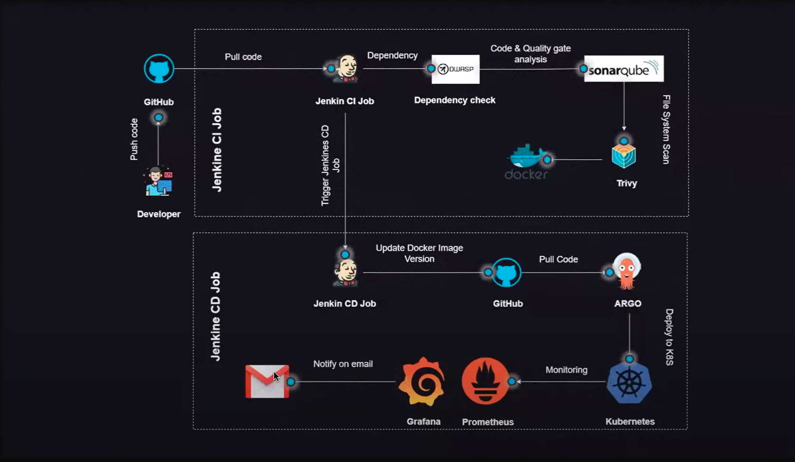
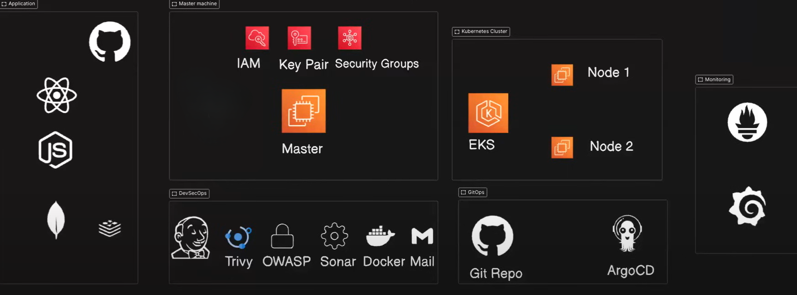
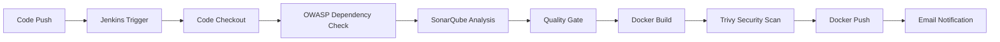
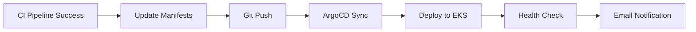

# 🚀 End-to-End DevSecOps Pipeline

A comprehensive DevSecOps implementation featuring automated CI/CD pipelines with integrated security scanning, quality gates, and monitoring on AWS EKS.

## 📹 Project Demo

[]([https://www.youtube.com/watch?v=PGu7OSA8Ps4])

> **Click the thumbnail above to watch the complete DevSecOps pipeline demonstration**

### 🎥 What you'll see in the demo:
- **CI Pipeline**: Automated builds, testing, and security scans
- **Security Integration**: OWASP, SonarQube, and Trivy in action
- **Container Deployment**: Docker build and push to registry
- **GitOps Workflow**: ArgoCD deploying to AWS EKS
- **Monitoring Setup**: Prometheus and Grafana dashboards
- **Email Notifications**: Pipeline status alerts

### 📺 Alternative Demo Formats:
[](https://media.giphy.com/media/13HgwGsXF0aiGY/giphy.gif)
[](https://akm.github.io/devops_end_to_end)

## 🏗️ Architecture Overview



This project implements a complete DevSecOps lifecycle with the following workflow:

1. **Developer** pushes code to **GitHub**
2. **Jenkins CI Pipeline** triggers automatically
3. **Security & Quality Scanning** with OWASP, SonarQube, and Trivy
4. **Docker Image** build and push to registry
5. **Jenkins CD Pipeline** updates Kubernetes manifests
6. **ArgoCD** deploys to **AWS EKS** cluster
7. **Monitoring** with Prometheus and Grafana
8. **Email Notifications** for pipeline status



## 🛠️ Tech Stack

| Category | Tools |
|----------|-------|
| **Source Control** |  |
| **CI/CD** |   |
| **Security Scanning** |   |
| **Code Quality** |  |
| **Containerization** |  |
| **Orchestration** |   |
| **Monitoring** |   |
| **Notifications** |  |
| **Caching** |  |

## 🔄 Pipeline Workflows

### CI Pipeline (Continuous Integration)


### CD Pipeline (Continuous Deployment)


## 🚀 Quick Start

### Prerequisites

- AWS Account with appropriate permissions
- GitHub repository
- Gmail account for notifications
- Basic knowledge of Kubernetes and Docker

### Infrastructure Requirements

| Component | Instance Type | vCPU | RAM | Storage |
|-----------|---------------|------|-----|---------|
| Jenkins Master | t2.large | 2 | 8GB | 29GB |
| Jenkins Worker | t2.large | 2 | 8GB | 29GB |
| EKS Nodes | t2.large | 2 | 8GB | 29GB |

## 📋 Installation Guide

> **Important**: This project is implemented in the **us-west-1** (North California) region.

### Quick Navigation

| Component | Installation Link |
|-----------|------------------|
| Jenkins Master | [🔧 Install Jenkins](#jenkins-installation) |
| AWS EKS | [☸️ Setup EKS](#eks-setup) |
| ArgoCD | [🔄 Install ArgoCD](#argocd-installation) |
| Jenkins Worker | [👷 Setup Worker](#jenkins-worker-setup) |
| OWASP | [🛡️ Configure OWASP](#owasp-setup) |
| SonarQube | [📊 Setup SonarQube](#sonarqube-setup) |
| Email Notifications | [📧 Email Setup](#email-setup) |
| Monitoring | [📈 Monitoring Setup](#monitoring-setup) |

### 🔧 Jenkins Installation

1. **Create Master Machine**
   ```bash
   # Launch t2.large instance with 29GB storage
   # Configure security groups (ports: 22, 8080, 9000, 465)
   ```

2. **Install Docker**
   ```bash
   sudo apt-get update
   sudo apt-get install docker.io -y
   sudo usermod -aG docker ubuntu && newgrp docker
   ```

3. **Install Jenkins**
   ```bash
   sudo apt update -y
   sudo apt install fontconfig openjdk-17-jre -y

   sudo wget -O /usr/share/keyrings/jenkins-keyring.asc \
     https://pkg.jenkins.io/debian-stable/jenkins.io-2023.key
     
   echo "deb [signed-by=/usr/share/keyrings/jenkins-keyring.asc]" \
     https://pkg.jenkins.io/debian-stable binary/ | sudo tee \
     /etc/apt/sources.list.d/jenkins.list > /dev/null
     
   sudo apt-get update -y
   sudo apt-get install jenkins -y
   ```

4. **Access Jenkins**
   - Navigate to `http://<master-ip>:8080`
   - Complete initial setup wizard

### ☸️ EKS Setup

1. **Install AWS CLI**
   ```bash
   curl "https://awscli.amazonaws.com/awscli-exe-linux-x86_64.zip" -o "awscliv2.zip"
   sudo apt install unzip
   unzip awscliv2.zip
   sudo ./aws/install
   aws configure
   ```

2. **Install kubectl**
   ```bash
   curl -o kubectl https://amazon-eks.s3.us-west-2.amazonaws.com/1.19.6/2021-01-05/bin/linux/amd64/kubectl
   chmod +x ./kubectl
   sudo mv ./kubectl /usr/local/bin
   kubectl version --short --client
   ```

3. **Install eksctl**
   ```bash
   curl --silent --location "https://github.com/weaveworks/eksctl/releases/latest/download/eksctl_$(uname -s)_amd64.tar.gz" | tar xz -C /tmp
   sudo mv /tmp/eksctl /usr/local/bin
   eksctl version
   ```

4. **Create EKS Cluster**
   ```bash
   eksctl create cluster --name=wanderlust \
                       --region=us-east-2 \
                       --version=1.30 \
                       --without-nodegroup
   ```

5. **Associate IAM OIDC Provider**
   ```bash
   eksctl utils associate-iam-oidc-provider \
     --region us-east-2 \
     --cluster wanderlust \
     --approve
   ```

6. **Create Node Group**
   ```bash
   eksctl create nodegroup --cluster=wanderlust \
                        --region=us-east-2 \
                        --name=wanderlust \
                        --node-type=t2.large \
                        --nodes=2 \
                        --nodes-min=2 \
                        --nodes-max=2 \
                        --node-volume-size=29 \
                        --ssh-access \
                        --ssh-public-key=eks-nodegroup-key 
   ```

### 👷 Jenkins Worker Setup

1. **Create Worker Instance**
   ```bash
   # Launch t2.large instance with same security group as master
   sudo apt update -y
   sudo apt install fontconfig openjdk-17-jre -y
   ```

2. **Configure IAM Role**
   - Create IAM role with Administrator access
   - Attach to Jenkins worker instance

3. **Install AWS CLI & Docker**
   ```bash
   # Install AWS CLI (same as master)
   sudo apt install docker.io -y
   sudo usermod -aG docker ubuntu && newgrp docker
   ```

4. **Setup SSH Keys**
   ```bash
   # On master machine
   ssh-keygen
   # Copy public key to worker's authorized_keys
   ```

5. **Add Worker to Jenkins**
   - Go to `Manage Jenkins > Nodes`
   - Add permanent agent with SSH connection

### 📊 SonarQube Setup

```bash
docker run -itd --name SonarQube-Server -p 9000:9000 sonarqube:lts-community
```

### 🛡️ Trivy Installation

```bash
sudo apt-get install wget apt-transport-https gnupg lsb-release -y
wget -qO - https://aquasecurity.github.io/trivy-repo/deb/public.key | sudo apt-key add -
echo deb https://aquasecurity.github.io/trivy-repo/deb $(lsb_release -sc) main | sudo tee -a /etc/apt/sources.list.d/trivy.list
sudo apt-get update -y
sudo apt-get install trivy -y
```

### 🔄 ArgoCD Installation

1. **Create Namespace**
   ```bash
   kubectl create namespace argocd
   ```

2. **Install ArgoCD**
   ```bash
   kubectl apply -n argocd -f https://raw.githubusercontent.com/argoproj/argo-cd/stable/manifests/install.yaml
   ```

3. **Install ArgoCD CLI**
   ```bash
   sudo curl --silent --location -o /usr/local/bin/argocd https://github.com/argoproj/argo-cd/releases/download/v2.4.7/argocd-linux-amd64
   sudo chmod +x /usr/local/bin/argocd
   ```

4. **Expose ArgoCD Server**
   ```bash
   kubectl patch svc argocd-server -n argocd -p '{"spec": {"type": "NodePort"}}'
   ```

5. **Get Initial Password**
   ```bash
   kubectl -n argocd get secret argocd-initial-admin-secret -o jsonpath="{.data.password}" | base64 -d; echo
   ```

### 📧 Email Setup

1. **Enable 2-Step Verification** in Gmail
2. **Generate App Password** for Jenkins
3. **Configure Jenkins Email Settings**
   - Go to `Manage Jenkins > System`
   - Configure Extended E-mail Notification
   - Configure E-mail Notification

### 📈 Monitoring Setup

1. **Install Helm**
   ```bash
   curl -fsSL -o get_helm.sh https://raw.githubusercontent.com/helm/helm/main/scripts/get-helm-3
   chmod 700 get_helm.sh
   ./get_helm.sh
   ```

2. **Add Helm Repositories**
   ```bash
   helm repo add stable https://charts.helm.sh/stable
   helm repo add prometheus-community https://prometheus-community.github.io/helm-charts
   ```

3. **Install Prometheus Stack**
   ```bash
   kubectl create namespace prometheus
   helm install stable prometheus-community/kube-prometheus-stack -n prometheus
   ```

4. **Expose Services**
   ```bash
   # Expose Prometheus
   kubectl edit svc stable-kube-prometheus-sta-prometheus -n prometheus
   
   # Expose Grafana
   kubectl edit svc stable-grafana -n prometheus
   ```

5. **Get Grafana Password**
   ```bash
   kubectl get secret --namespace prometheus stable-grafana -o jsonpath="{.data.admin-password}" | base64 --decode ; echo
   ```

## 🔐 Security Features

### OWASP Dependency Check
- Scans for known vulnerabilities in project dependencies
- Generates detailed security reports
- Fails pipeline on high-severity vulnerabilities

### Trivy Container Scanning
- Scans Docker images for OS and library vulnerabilities
- Checks for misconfigurations
- Provides detailed vulnerability reports

### SonarQube Code Quality
- Static code analysis
- Code coverage reports
- Security hotspot detection
- Quality gate enforcement

## 📊 Monitoring & Observability

### Prometheus Metrics
- Kubernetes cluster metrics
- Application performance metrics
- Custom business metrics

### Grafana Dashboards
- Cluster overview dashboard
- Node and pod monitoring
- Application-specific dashboards
- Alert visualization

## 🔧 Pipeline Configuration

### Required Jenkins Plugins
- OWASP Dependency-Check
- SonarQube Scanner
- Docker Pipeline
- Pipeline: Stage View
- Email Extension

### Environment Variables
```bash
DOCKER_REGISTRY=your-registry
SONAR_TOKEN=your-sonar-token
GITHUB_TOKEN=your-github-token
```

## 📝 Usage

1. **Fork this repository**
2. **Update configuration files** with your specific details
3. **Configure Jenkins pipelines** using provided Jenkinsfiles
4. **Set up ArgoCD applications** pointing to your repository
5. **Push code changes** to trigger the pipeline

## 🧹 Cleanup

To avoid AWS charges, clean up resources:

```bash
# Delete EKS cluster
eksctl delete cluster --name=wanderlust --region=us-west-1

# Terminate EC2 instances
# Delete security groups
# Remove IAM roles and policies
```

## 🤝 Contributing

1. Fork the repository
2. Create a feature branch
3. Make your changes
4. Add tests if applicable
5. Submit a pull request

<<<<<<< HEAD
## 📄 License

This project is licensed under the MIT License - see the [LICENSE](LICENSE) file for details.
=======
>>>>>>> ba49dc55e996c5cca2f6dbe8fa571f6d451d35dd

## 🙏 Acknowledgments

- Jenkins community for excellent CI/CD tools
- ArgoCD team for GitOps implementation
- AWS for cloud infrastructure
- Open source security tools (OWASP, Trivy, SonarQube)

<<<<<<< HEAD
## 📞 Support

For questions and support:
- Create an issue in this repository
- Contact: [your-email@example.com]

---
=======
>>>>>>> ba49dc55e996c5cca2f6dbe8fa571f6d451d35dd

⭐ **Star this repository if you found it helpful!**


